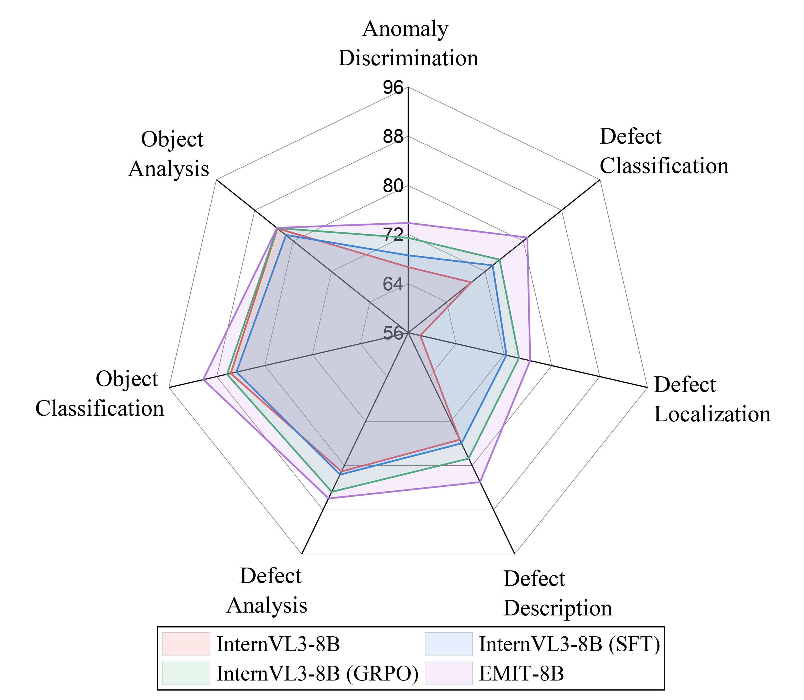
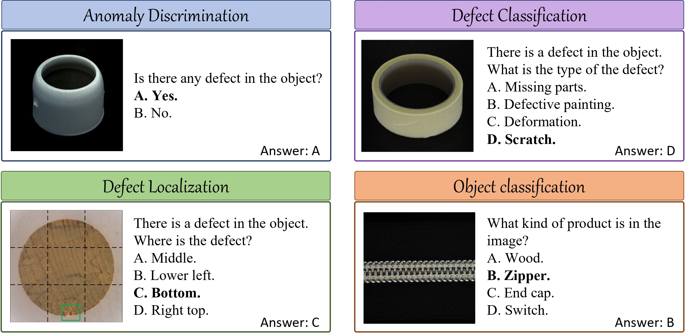
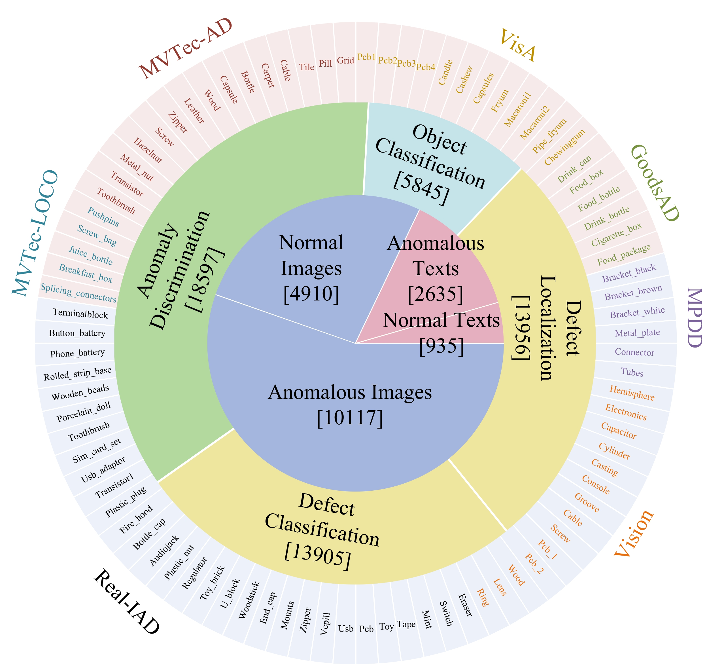
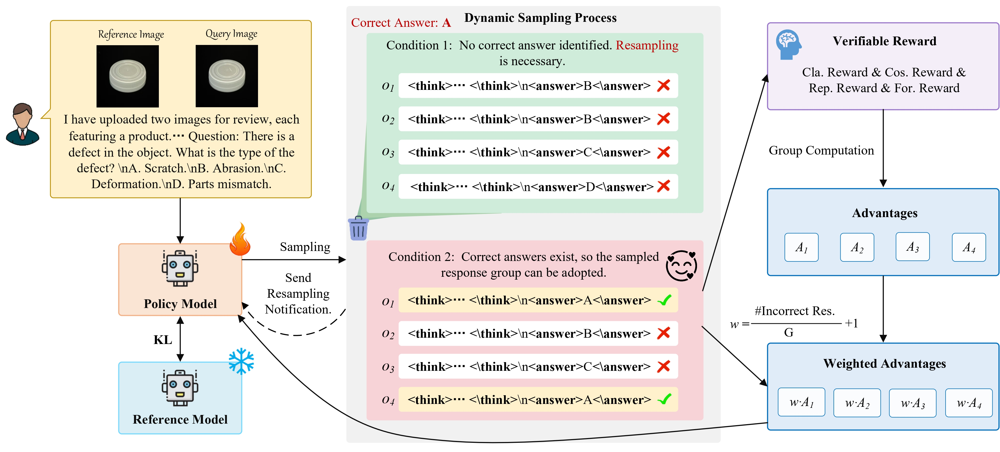

# EMIT: Enhancing MLLMs for Industrial Anomaly Detection via Difficulty-Aware GRPO

[](https://github.com/M-3LAB/awesome-industrial-anomaly-detection) 

[](https://arxiv.org/abs/2507.21619)
[](https://huggingface.co/gw49/EMIT-8B) 

## 👀 Overview
Industrial anomaly detection (IAD) plays a crucial role in maintaining the safety and reliability of manufacturing systems. While Multimodal Large Language Models (MLLMs) show strong vision-language reasoning abilities, their effectiveness in IAD remains limited without domain-specific adaptation. In this work, we propose EMIT, a unified framework that enhances MLLMs for IAD via difficulty-aware Group Relative Policy Optimization (GRPO). EMIT constructs a multi-task IAD dataset and utilizes GPT-generated descriptions to compensate for missing defective images. For few-shot anomaly detection, it integrates soft prompts and heatmap-guided contrastive embeddings derived from patch-level comparisons. To better train on challenging cases, we propose a difficulty-aware GRPO that includes a resampling strategy and an advantage reweighting mechanism to emphasize hard samples. Extensive experiments on the MMAD benchmark demonstrate that EMIT significantly enhances the IAD performance of MLLMs, improving the base model (InternVL3) by an average of 7.77\%.





## 📦 Install Dependencies
Before running the project, make sure to install all the required Python packages. You can do this easily using the `requirements.txt` file:

```bash
pip install -r requirements.txt
```

## 🔮 Training and Evaluation Pipeline

### 1. Training Data Preparation

To prepare the training samples in JSONL data format, each sample should be a dictionary (`dict`).

####  Training Stage 1: SFT
- **Mandatory Keys**:
  - **`images`**: A list containing the absolute paths of the images.
  - **`messages`**: Conversation content where the `'assistant'` role is mandatory to provide supervised signals.

📄  Example Data Sample
```
{"id": 0, "images": ["/mnt/vlr/laishi/IADtraindata/MPDD/bracket_black/train/good/185.png", "/mnt/vlr/laishi/IADtraindata/MPDD/bracket_black/test/scratches/000.png"], "messages": [{"role": "user", "content": "Image-1: <image>\nImage-2: <image>\nI have uploaded two images for review, each featuring a product. The product shown in the first image appears to be in perfect condition, free of any defects. To answer a multiple-choice question, please inspect the product in the second image. There is only one correct option.\nThe following provides domain knowledge regarding the characteristics of a normal product, as well as the various possible types of defects: <Normal Characteristics>\n Description: A standard \"bracket_black\" typically features a robust, metallic construction designed for durability and strength. The bracket is usually coated in a uniform, black finish that provides corrosion resistance and a sleek appearance. Its structure generally includes multiple mounting holes or slots for versatile installation options and may carry specific design features such as hooks or clamps depending on its intended use. This type of bracket is often utilized in various applications ranging from industrial settings to everyday household use, serving as a secure mounting solution for items like shelves, machinery components, or other hardware. The design ensures that it can withstand significant weight or stress, making it a practical choice for supporting or holding various objects securely in place.\n<Scratches Defect>\n Description: The \"scratches\" defect on the \"bracket_black\" object can be visually identified by looking for persistent, linear markings that typically show variances in the reflection of light due to their irregular surface compared to the surrounding area. These scratches might appear as fine or deep lines or grooves that disrupt the uniform appearance of the object's coating, revealing the underlying material or simply creating a texture contrast. They can be scattered across the surface or concentrated in one area, and their orientation can be unidirectional or random. Scratches are generally visible without magnification, although lighting conditions can affect their visibility.  When examining other images of \"bracket_black\" for similar defects: - Look for any linear abrasions or disruptions on the surface. - Notice changes in the glossiness or texture of the surface where these lines appear. - Check for variations in light reflection which might indicate depth changes due to the scratches.  This type of analysis allows for the consistent identification of scratch defects on similar objects in varied images.\n<Hole Defect>\n Description: To identify the \"hole\" defect on the \"bracket_black\" or similar objects in other images, look for key visual characteristics that include:  1. **Abrupt Interruptions in Surface Continuity**: Examine the surface of the metal bracket for unexpected interruptions where the metal should be smooth and intact. The defect will appear as an area where material is missing, disrupting the uniform surface of the object.  2. **Shape and Size**: The defect will typically be round or oval in shape and could vary in size. This hole might appear distinctly smaller or larger relative to the overall size of the object, but usually, it is conspicuous enough to be noticeable against the smooth surrounding metal.  3. **Edge Definition**: Edges of the hole defect might appear jagged or sharply defined, contrasting with the mostly smooth edges found on the rest of the object. This can help in distinguishing it from mere surface scratches or dents.  4. **Location on the Object**: While the defect can potentially be located anywhere on the object, it often might be found in areas more susceptible to wear or impact. Check along edges, near attachment points, or on flat surfaces.  5. **Color and Texture Contrast**: Shadows or lights might create a contrast around the defect, making it more noticeable. The texture inside the defect may also differ; it might look rougher or grainy compared to the polished smoothness of the rest of the object.  When examining other images for this type of defect, these characteristics should guide you in determining whether the \"bracket_black\" objects in those images exhibit similar issues.\nSelect your answer by responding with the letter corresponding to the correct option, such as 'A'. Do not include any text in your response.\n\nQuestion: Is there any defect in the object? \nA. No.\nB. Yes.\n"}, {"role": "assistant", "content": "B"}]}
```

#### Traing Stage 2: GRPO
- **Mandatory Keys**:
  - **`images`**: A list containing the absolute paths of the images.
  - **`messages`**: Conversation content.
  - **`solution`**: Verifiable answers for computing rewards during training.

📄  Example Data Sample
```
{"id": 0, "images": ["/mnt/vlr/laishi/IADtraindata/MPDD/bracket_black/train/good/185.png", "/mnt/vlr/laishi/IADtraindata/MPDD/bracket_black/test/scratches/000.png"], "messages": [{"role": "user", "content": "Image-1: <image>\nImage-2: <image>\nI have uploaded two images for review, each featuring a product. The product shown in the first image appears to be in perfect condition, free of any defects. To answer a multiple-choice question, please inspect the product in the second image. There is only one correct option.\nThe following provides domain knowledge regarding the characteristics of a normal product, as well as the various possible types of defects: <Normal Characteristics>\n Description: A standard \"bracket_black\" typically features a robust, metallic construction designed for durability and strength. The bracket is usually coated in a uniform, black finish that provides corrosion resistance and a sleek appearance. Its structure generally includes multiple mounting holes or slots for versatile installation options and may carry specific design features such as hooks or clamps depending on its intended use. This type of bracket is often utilized in various applications ranging from industrial settings to everyday household use, serving as a secure mounting solution for items like shelves, machinery components, or other hardware. The design ensures that it can withstand significant weight or stress, making it a practical choice for supporting or holding various objects securely in place.\n<Scratches Defect>\n Description: The \"scratches\" defect on the \"bracket_black\" object can be visually identified by looking for persistent, linear markings that typically show variances in the reflection of light due to their irregular surface compared to the surrounding area. These scratches might appear as fine or deep lines or grooves that disrupt the uniform appearance of the object's coating, revealing the underlying material or simply creating a texture contrast. They can be scattered across the surface or concentrated in one area, and their orientation can be unidirectional or random. Scratches are generally visible without magnification, although lighting conditions can affect their visibility.  When examining other images of \"bracket_black\" for similar defects: - Look for any linear abrasions or disruptions on the surface. - Notice changes in the glossiness or texture of the surface where these lines appear. - Check for variations in light reflection which might indicate depth changes due to the scratches.  This type of analysis allows for the consistent identification of scratch defects on similar objects in varied images.\n<Hole Defect>\n Description: To identify the \"hole\" defect on the \"bracket_black\" or similar objects in other images, look for key visual characteristics that include:  1. **Abrupt Interruptions in Surface Continuity**: Examine the surface of the metal bracket for unexpected interruptions where the metal should be smooth and intact. The defect will appear as an area where material is missing, disrupting the uniform surface of the object.  2. **Shape and Size**: The defect will typically be round or oval in shape and could vary in size. This hole might appear distinctly smaller or larger relative to the overall size of the object, but usually, it is conspicuous enough to be noticeable against the smooth surrounding metal.  3. **Edge Definition**: Edges of the hole defect might appear jagged or sharply defined, contrasting with the mostly smooth edges found on the rest of the object. This can help in distinguishing it from mere surface scratches or dents.  4. **Location on the Object**: While the defect can potentially be located anywhere on the object, it often might be found in areas more susceptible to wear or impact. Check along edges, near attachment points, or on flat surfaces.  5. **Color and Texture Contrast**: Shadows or lights might create a contrast around the defect, making it more noticeable. The texture inside the defect may also differ; it might look rougher or grainy compared to the polished smoothness of the rest of the object.  When examining other images for this type of defect, these characteristics should guide you in determining whether the \"bracket_black\" objects in those images exhibit similar issues.\nSelect your answer by responding with the letter corresponding to the correct option, such as 'A'. Begin by documenting your analysis process within <think> </think> tags. Conclude with your final answer enclosed in <answer> </answer> tags. The final answer should be either 'A' or 'B' or 'C' or 'D'. The output format should be as follows: <think>...</think><answer>...</answer>. Please adhere strictly to the prescribed format.\n\nQuestion: Is there any defect in the object? \nA. No.\nB. Yes.\n"}], "solution": "B"}
```

More details for constructing the training dataset can be found in the [ms-swift: Custom-dataset](https://swift.readthedocs.io/en/latest/Customization/Custom-dataset.html).

### Dataset Overview
We collected **18,597** samples from **88** classes of industrial products across **seven** public datasets, generating a total of **52,303** multiple-choice questions spanning **four** key subtasks. Below is a statistical visualization of the dataset:




 
During training stage 1, we are focusing only on the tasks of Anomaly Discrimination and Defect Localization. 

📄 Example data samples for `Object Descriptive Text as Query Image`:
```
   {"id": 44437, "images": ["/mnt/vlr/laishi/IADdata/MVTec-AD/wood/train/good/175.png"], "messages": [{"role": "user", "content": "<image>\nThe product shown in the image appears to be in perfect condition, free of any defects. To address a multiple-choice question, kindly examine the product as described in the following text: The object exhibits a smooth surface with noticeable grain patterns that run vertically, displaying a natural wave-like texture. The color is a rich, warm reddish-brown tone, consistent throughout. There is a visible, thin line or crack that runs horizontally across, which appears lighter compared to the surrounding areas. The overall appearance suggests it is polished, with a matte finish that enhances the textural details without adding glossiness. The material is dense and appears to be of a high-quality, typically used for its durability and aesthetic appeal.\n\nPlease answer the multiple-choice question based on the details provided in the product\u2019s description. There is only one correct option.\nThe following provides domain knowledge regarding the characteristics of a normal product, as well as the various possible types of defects:  <Wood Defects>\n Description: The wooden surfaces exhibit multiple defects characterized by visible irregularities that disrupt the natural grain patterns and color consistency typical of wood. Common defects identified include:\n - Knots: Rounded or oval dark spots where irregular grain patterns are visible, indicating areas of denser wood structure. Knots may exhibit variations in texture and often appear darker than the surrounding wood.\n - Cracks: Jagged or linear breaks in the wood surface that can compromise structural integrity. Cracks often interrupt the natural flow of the grain and may appear darker or lighter than the surrounding wood.\n - Discolorations: Areas of irregular color, such as reddish stains or markings, contrasting sharply with the wood's usual tones. These could indicate damage from external factors or inherent wood characteristics.\n - Scratches: Surface abrasions that create lighter marks against the wood's natural coloration, usually running parallel or across the grain, distracting from the overall texture.\n - Holes: Small round depressions in the wood surface, potentially caused by wood-boring insects or other damages, which disrupt the uniformity of the grain.\n These defects collectively impact the aesthetic quality and potential structural application of the wood, differentiating it from a normal, uniform wood appearance.\n <Wood Surface Scratches>\n Description: The defect is characterized by the presence of scratches on the wooden surface that disrupt the natural grain pattern. These scratches are typically identified by their lighter color in contrast to the surrounding wood, indicating a removal of the surface layer or finish. The scratches can vary in length and orientation, appearing as jagged, irregular lines or thin, linear marks. They are concentrated in different regions of the wood panel, often notably disrupting the smoothness and aesthetic appeal of the wood. The variations in the scratches suggest mechanical abrasion or impact from sharp objects, leading to aesthetic damage that may also affect the structural integrity of the wood over time.\n <Normal Characteristics>\n Description: The images depict a flat wooden surface exhibiting a consistent, natural wood grain pattern with variations in color and texture. The surfaces are smooth and show a range of warm brown tones, featuring typical vertical grain lines that are generally parallel. Upon inspection, there are no visible defects such as cracks, knots, warping, or discoloration. The natural variations in grain and color are expected and lend to the aesthetic quality of the wood. Minute imperfections, like slight color variations or small nicks, are common in wood but do not indicate defects unless they affect the structural quality. Overall, the wood surfaces appear intact and well-maintained, aligning perfectly with the expected normal characteristics of such natural materials.\n <Wood Surface Defects>\n Description: The defects present on the wood surfaces include holes and cracks that interrupt the natural grain pattern and integrity of the wood. The holes vary in size and shape, appearing as dark circular voids or irregular openings that contrast with the surrounding wood's smooth texture. These holes may indicate compromise in the wood's structural integrity, likely resulting from natural processes or manufacturing issues. The cracks are characterized by their longitudinal nature, running through the wood and causing unevenness between the segments of the surface. These cracks often display slightly raised edges and darker interiors, suggesting depth. The combined presence of holes and cracks along with scratches disrupts the aesthetic and functional qualities of the wooden pieces, potentially affecting their usability and appearance.\n <Color Anomalies>\n Description: The defects identified are characterized by irregular discolorations on the wooden surface, manifesting as vivid spots or streaks that deviate from the expected uniformity of the wood grain. These color anomalies display varying hues, primarily consisting of reddish, bluish-gray, or darker shades that contrast sharply with the natural brown tones of the wood. The irregular shapes of these defects can range from elongated marks following the grain pattern to compact blotches that disrupt the visual consistency of the surface. They are located in different areas across the images, often centered or in prominent positions, and are indicative of potential issues such as wood staining, natural discoloration, or defects during the manufacturing process.\n <Wood Liquid Stain>\n Description: The defect is characterized by irregularly shaped discolorations on the wood surface, suggesting the impact of liquid exposure. These stains often appear darker than the surrounding wood, indicating potential absorption of moisture or liquid substances. The edges of the stains are typically blurred or not sharply defined, distinguishing them from the natural wood grain. The anomalies may vary in size and location, but they frequently disrupt the uniform texture and color of the wood, with many instances located towards the center or along the main grain pattern. Overall, these stains compromise the aesthetic appeal and consistency of the wooden material.\nSelect your answer by responding with the letter corresponding to the correct option, such as 'A'. Begin by documenting your analysis process within <think> </think> tags. Conclude with your final answer enclosed in <answer> </answer> tags. The final answer should be either 'A' or 'B' or 'C' or 'D'. The output format should be as follows: <think>...</think><answer>...</answer>. Please adhere strictly to the prescribed format.\n\nQuestion: There is a defect in the object. What is the effect of the defect? \nA. It makes the wood resistant to moisture.\nB. It improves the strength of the wood.\nC. It has no effect on the wood.\nD. It affects the aesthetic and structural integrity of the wood.\n"}], "solution": "D"}
```

### The URL for Seven Public Datasets
- [VISION](https://huggingface.co/datasets/VISION-Workshop/VISION-Datasets)
- [Real-IAD](https://huggingface.co/datasets/Real-IAD/Real-IAD/tree/main)
- [MPDD](https://vutbr-my.sharepoint.com/:f:/g/personal/xjezek16_vutbr_cz/EhHS_ufVigxDo3MC6Lweau0BVMuoCmhMZj6ddamiQ7-FnA?e=oHKCxI)
- [MVTec-LOCO](https://www.mvtec.com/company/research/datasets/mvtec-loco)
- [MVTec-AD](https://www.mvtec.com/company/research/datasets/mvtec-ad)
- [VisA](https://amazon-visual-anomaly.s3.us-west-2.amazonaws.com/VisA_20220922.tar)
- [GoodsAD](https://github.com/jianzhang96/GoodsAD)


### 2. Training
To begin training, start by downloading the open-source MLLM [InternVL3-8B](https://huggingface.co/OpenGVLab/InternVL3-8B/tree/main).

#### Training Stage 1: SFT

Navigate to the root directory of this project and configure the script `Stage1.sh`. Once configured, run the script to begin training.

Make sure to provide the following arguments:

- `--model`: Specify the absolute path to the `InternVL3-8B` model. For example: `/mnt/vlr/laishi/InternVL3-8B`
  
- `--dataset`: Specify the absolute path to the training data. For example: `/mnt/vlr/laishi/train_stage1_data.jsonl`
  
- `--output_dir`: Specify the path to save the trained model. For example: `stage1_outputs`

To run the script, use the following command:
```bash
sh Stage1.sh
```

#### Training Stage 2: GRPO


Navigate to the root directory of this project and configure the script `Stage2.sh`. Once configured, run the script to begin training.

Make sure to provide the following arguments:

- `--model`: Specify the path to the trained model from stage 1. For example: `stage1_outputs/v1-20250701-172230/checkpoint-6000`
  
- `--dataset`: Specify the absolute path to the training data. For example: `/mnt/vlr/laishi/train_stage2_data.jsonl`
  
- `--output_dir`: Specify the path to save the trained model. For example: `stage2_outputs`

To run the script, use the following command:
```bash
sh Stage2.sh
```

More details for the training arguments can be found in the [ms-swift: Command-Line-Parameters](https://swift.readthedocs.io/en/latest/Instruction/Command-line-parameters.html).

### 3. Testing Data Preparation
We use the [MMAD dataset](https://arxiv.org/abs/2410.09453) as our evaluation benchmark. Download the MMAD ZIP file:
```bash 
wget -O ALL_DATA.zip https://huggingface.co/datasets/jiang-cc/MMAD/resolve/refs%2Fpr%2F1/ALL_DATA.zip?download=true
unzip ALL_DATA.zip
```

```
   ├── ALL_DATA
   │ ├── DS-MVTec
   │ ├── GoodsAD
   │ ├── MVTec-AD
   │ ├── MVTec-LOCO
   │ ├── VisA
   │ ├── domain_knowledge.json 
   │ └── mmad.json
```


*Note: The original MMAD dataset contains some errors. To ensure accuracy, replace the erroneous files with our fixed dataset available in the ALL_DATA directory of our repository.*


### 4. Run Evaluation
#### Benchmark Methods
The Python scripts for testing existing open-source MLLMs are located in the `eval_benchmark` folder. Each script requires the following mandatory arguments:  
- `--checkpoint`: Specifies the path to the model checkpoint.
- `--data-root`: Provides the root directory for the MMAD dataset.

📌 Example Usage
1. Navigate to the project's root directory.  
2. Set the `PYTHONPATH` environment variable:  

   ```bash
   export PYTHONPATH=$(pwd):$PYTHONPATH
   ```
3. Run the desired evaluation script. For example:

   ```bash
    python eval_benchmark/evaluate_batch_mmad_choice_llava_interleave.py --checkpoint /mnt/vlr/laishi/llava-interleave-qwen-7b-hf --data-root /mnt/vlr/laishi/ALL_DATA/
    ```
In this example:

The `--checkpoint` argument points to the model checkpoint located at `/mnt/vlr/laishi/llava-interleave-qwen-7b-hf`.
The `--data-root` argument specifies the MMAD dataset directory at `/mnt/vlr/laishi/ALL_DATA/`.

#### Evaluate Our Trained Model
You can effortlessly download our pre-trained model 😊[EMIT-8B](https://huggingface.co/gw49/EMIT-8B) for testing.

The `evaluate_batch_mmad_choice.py` script, located in the project's root directory, is designed to evaluate our methods. The script requires the following mandatory arguments:
- `--checkpoint`: Specifies the path to the model checkpoint.
- `--data-root`: Provides the root directory for the MMAD dataset.

📌 Example Usage
1. Navigate to the project's root directory.  
2. Set the `PYTHONPATH` environment variable:  

   ```bash
   export PYTHONPATH=$(pwd):$PYTHONPATH
   ```
3. Run the desired evaluation script. For example:

   ```bash
    python evaluate_batch_mmad_choice.py --checkpoint /mnt/vlr/laishi/EMIT-8B --data-root /mnt/vlr/laishi/ALL_DATA/
    ```
In this example:

The `--checkpoint` argument points to the model checkpoint located at `/mnt/vlr/laishi/EMIT-8B`.
The `--data-root` argument specifies the MMAD dataset directory at `/mnt/vlr/laishi/ALL_DATA/`.


## BibTex Citation

If you find this paper and repository useful, please cite our paper☺️.
```
@article{guan2025emit,
  title={EMIT: Enhancing MLLMs for Industrial Anomaly Detection via Difficulty-Aware GRPO},
  author={Guan, Wei and Lan, Jun and Cao, Jian and Tan, Hao and Zhu, Huijia and Wang, Weiqiang},
  journal={arXiv preprint arXiv:2507.21619},
  year={2025}
}
```  
