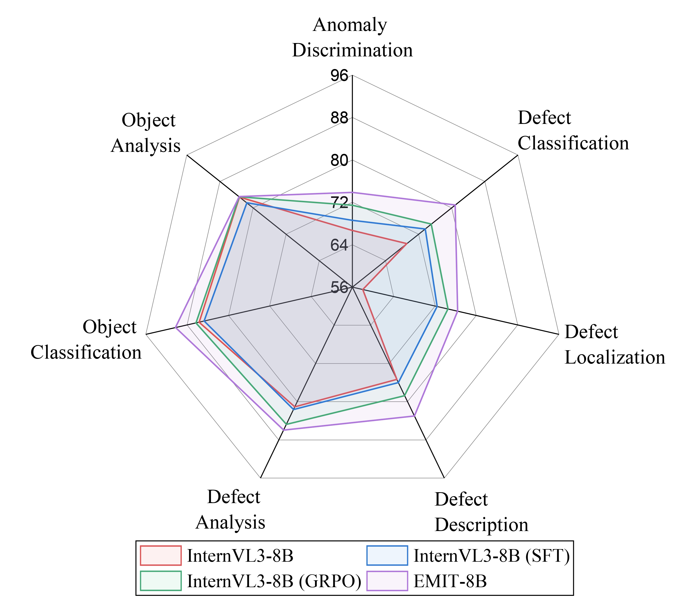

# EMIT: Enhancing MLLMs for Industrial Anomaly Detection via Difficulty-Aware GRPO

[](https://github.com/M-3LAB/awesome-industrial-anomaly-detection) 

[](https://arxiv.org/abs/2410.09453)
[](https://huggingface.co/datasets/jiang-cc/MMAD) 

## 👀 Overview
Industrial anomaly detection (IAD) plays a crucial role in maintaining the safety and reliability of manufacturing systems. While Multimodal Large Language Models (MLLMs) show strong vision-language reasoning abilities, their effectiveness in IAD remains limited without domain-specific adaptation. In this work, we propose EMIT, a unified framework that enhances MLLMs for IAD via difficulty-aware Group Relative Policy Optimization (GRPO). EMIT constructs a multi-task IAD dataset and utilizes GPT-generated descriptions to compensate for missing defective images. For few-shot anomaly detection, it integrates soft prompts and heatmap-guided contrastive embeddings derived from patch-level comparisons. To better train on challenging cases, we propose a difficulty-aware GRPO that includes a resampling strategy and an advantage reweighting mechanism to emphasize hard samples. Extensive experiments on the MMAD benchmark demonstrate that EMIT significantly enhances the IAD performance of MLLMs, improving the base model (InternVL3) by an average of 7.77\%..




## 🔮 Training and Evaluation Pipeline

### 1. Training Data Preparation

To prepare the training samples in JSONL data format, each sample should be a dictionary (`dict`).

####  Training Stage 1: SFT
- **Mandatory Keys**:
  - **`images`**: A list containing the absolute paths of the images.
  - **`messages`**: Conversation content where the `'assistant'` role is mandatory to provide supervised signals.
```
{"id": 0, "images": ["/mnt/vlr/laishi/IADtraindata/MPDD/bracket_black/train/good/185.png", "/mnt/vlr/laishi/IADtraindata/MPDD/bracket_black/test/scratches/000.png"], "messages": [{"role": "user", "content": "Image-1: <image>\nImage-2: <image>\nI have uploaded two images for review, each featuring a product. The product shown in the first image appears to be in perfect condition, free of any defects. To answer a multiple-choice question, please inspect the product in the second image. There is only one correct option.\nThe following provides domain knowledge regarding the characteristics of a normal product, as well as the various possible types of defects: <Normal Characteristics>\n Description: A standard \"bracket_black\" typically features a robust, metallic construction designed for durability and strength. The bracket is usually coated in a uniform, black finish that provides corrosion resistance and a sleek appearance. Its structure generally includes multiple mounting holes or slots for versatile installation options and may carry specific design features such as hooks or clamps depending on its intended use. This type of bracket is often utilized in various applications ranging from industrial settings to everyday household use, serving as a secure mounting solution for items like shelves, machinery components, or other hardware. The design ensures that it can withstand significant weight or stress, making it a practical choice for supporting or holding various objects securely in place.\n<Scratches Defect>\n Description: The \"scratches\" defect on the \"bracket_black\" object can be visually identified by looking for persistent, linear markings that typically show variances in the reflection of light due to their irregular surface compared to the surrounding area. These scratches might appear as fine or deep lines or grooves that disrupt the uniform appearance of the object's coating, revealing the underlying material or simply creating a texture contrast. They can be scattered across the surface or concentrated in one area, and their orientation can be unidirectional or random. Scratches are generally visible without magnification, although lighting conditions can affect their visibility.  When examining other images of \"bracket_black\" for similar defects: - Look for any linear abrasions or disruptions on the surface. - Notice changes in the glossiness or texture of the surface where these lines appear. - Check for variations in light reflection which might indicate depth changes due to the scratches.  This type of analysis allows for the consistent identification of scratch defects on similar objects in varied images.\n<Hole Defect>\n Description: To identify the \"hole\" defect on the \"bracket_black\" or similar objects in other images, look for key visual characteristics that include:  1. **Abrupt Interruptions in Surface Continuity**: Examine the surface of the metal bracket for unexpected interruptions where the metal should be smooth and intact. The defect will appear as an area where material is missing, disrupting the uniform surface of the object.  2. **Shape and Size**: The defect will typically be round or oval in shape and could vary in size. This hole might appear distinctly smaller or larger relative to the overall size of the object, but usually, it is conspicuous enough to be noticeable against the smooth surrounding metal.  3. **Edge Definition**: Edges of the hole defect might appear jagged or sharply defined, contrasting with the mostly smooth edges found on the rest of the object. This can help in distinguishing it from mere surface scratches or dents.  4. **Location on the Object**: While the defect can potentially be located anywhere on the object, it often might be found in areas more susceptible to wear or impact. Check along edges, near attachment points, or on flat surfaces.  5. **Color and Texture Contrast**: Shadows or lights might create a contrast around the defect, making it more noticeable. The texture inside the defect may also differ; it might look rougher or grainy compared to the polished smoothness of the rest of the object.  When examining other images for this type of defect, these characteristics should guide you in determining whether the \"bracket_black\" objects in those images exhibit similar issues.\nSelect your answer by responding with the letter corresponding to the correct option, such as 'A'. Do not include any text in your response.\n\nQuestion: Is there any defect in the object? \nA. No.\nB. Yes.\n"}, {"role": "assistant", "content": "B"}]}
```

#### Traing Stage 2: GRPO
- **Mandatory Keys**:
  - **`images`**: A list containing the absolute paths of the images.
  - **`messages`**: Conversation content.
  - **`solution`**: Verifiable answers for computing rewards during training.
```
{"id": 0, "images": ["/mnt/vlr/laishi/IADtraindata/MPDD/bracket_black/train/good/185.png", "/mnt/vlr/laishi/IADtraindata/MPDD/bracket_black/test/scratches/000.png"], "messages": [{"role": "user", "content": "Image-1: <image>\nImage-2: <image>\nI have uploaded two images for review, each featuring a product. The product shown in the first image appears to be in perfect condition, free of any defects. To answer a multiple-choice question, please inspect the product in the second image. There is only one correct option.\nThe following provides domain knowledge regarding the characteristics of a normal product, as well as the various possible types of defects: <Normal Characteristics>\n Description: A standard \"bracket_black\" typically features a robust, metallic construction designed for durability and strength. The bracket is usually coated in a uniform, black finish that provides corrosion resistance and a sleek appearance. Its structure generally includes multiple mounting holes or slots for versatile installation options and may carry specific design features such as hooks or clamps depending on its intended use. This type of bracket is often utilized in various applications ranging from industrial settings to everyday household use, serving as a secure mounting solution for items like shelves, machinery components, or other hardware. The design ensures that it can withstand significant weight or stress, making it a practical choice for supporting or holding various objects securely in place.\n<Scratches Defect>\n Description: The \"scratches\" defect on the \"bracket_black\" object can be visually identified by looking for persistent, linear markings that typically show variances in the reflection of light due to their irregular surface compared to the surrounding area. These scratches might appear as fine or deep lines or grooves that disrupt the uniform appearance of the object's coating, revealing the underlying material or simply creating a texture contrast. They can be scattered across the surface or concentrated in one area, and their orientation can be unidirectional or random. Scratches are generally visible without magnification, although lighting conditions can affect their visibility.  When examining other images of \"bracket_black\" for similar defects: - Look for any linear abrasions or disruptions on the surface. - Notice changes in the glossiness or texture of the surface where these lines appear. - Check for variations in light reflection which might indicate depth changes due to the scratches.  This type of analysis allows for the consistent identification of scratch defects on similar objects in varied images.\n<Hole Defect>\n Description: To identify the \"hole\" defect on the \"bracket_black\" or similar objects in other images, look for key visual characteristics that include:  1. **Abrupt Interruptions in Surface Continuity**: Examine the surface of the metal bracket for unexpected interruptions where the metal should be smooth and intact. The defect will appear as an area where material is missing, disrupting the uniform surface of the object.  2. **Shape and Size**: The defect will typically be round or oval in shape and could vary in size. This hole might appear distinctly smaller or larger relative to the overall size of the object, but usually, it is conspicuous enough to be noticeable against the smooth surrounding metal.  3. **Edge Definition**: Edges of the hole defect might appear jagged or sharply defined, contrasting with the mostly smooth edges found on the rest of the object. This can help in distinguishing it from mere surface scratches or dents.  4. **Location on the Object**: While the defect can potentially be located anywhere on the object, it often might be found in areas more susceptible to wear or impact. Check along edges, near attachment points, or on flat surfaces.  5. **Color and Texture Contrast**: Shadows or lights might create a contrast around the defect, making it more noticeable. The texture inside the defect may also differ; it might look rougher or grainy compared to the polished smoothness of the rest of the object.  When examining other images for this type of defect, these characteristics should guide you in determining whether the \"bracket_black\" objects in those images exhibit similar issues.\nSelect your answer by responding with the letter corresponding to the correct option, such as 'A'. Begin by documenting your analysis process within <think> </think> tags. Conclude with your final answer enclosed in <answer> </answer> tags. The final answer should be either 'A' or 'B' or 'C' or 'D'. The output format should be as follows: <think>...</think><answer>...</answer>. Please adhere strictly to the prescribed format.\n\nQuestion: Is there any defect in the object? \nA. No.\nB. Yes.\n"}], "solution": "B"}
```

More details for constructing the training dataset can be found in the [ms-swift: Custom-dataset](https://swift.readthedocs.io/en/latest/Customization/Custom-dataset.html).

### Dataset Overview
We collected **18,597** samples from **88** classes of industrial products across **seven** public datasets, generating a total of **52,303** multiple-choice questions spanning **four** key subtasks. Below is a statistical visualization of the dataset:


 
During training stage 1, you are focusing only on the tasks of Anomaly Discrimination and Defect Localization. 


### 2. Training
To begin training, start by downloading the open-source MLLM [InternVL3-8B](https://huggingface.co/OpenGVLab/InternVL3-8B/tree/main).

#### Training Stage 1: SFT

Navigate to the root directory of this project and configure the script `Stage1.sh`. Once configured, run the script to begin training.

Make sure to provide the following arguments:

- `--model`: Specify the absolute path to the `InternVL3-8B` model. For example: `/mnt/vlr/laishi/InternVL3-8B`
  
- `--dataset`: Specify the absolute path to the training data. For example: `/mnt/vlr/laishi/train_stage1_data.jsonl`
  
- `--output_dir`: Specify the path to save the trained model. For example: `stage1_outputs`

To run the script, use the following command:
```bash
sh Stage1.sh
```

#### Training Stage 2: GRPO


Navigate to the root directory of this project and configure the script `Stage2.sh`. Once configured, run the script to begin training.

Make sure to provide the following arguments:

- `--model`: Specify the path to the trained model from stage 1. For example: `stage1_outputs/v1-20250701-172230/checkpoint-6000`
  
- `--dataset`: Specify the absolute path to the training data. For example: `/mnt/vlr/laishi/train_stage2_data.jsonl`
  
- `--output_dir`: Specify the path to save the trained model. For example: `stage2_outputs`

To run the script, use the following command:
```bash
sh Stage2.sh
```

More details for the training arguments can be found in the [ms-swift: Command-Line-Parameters](https://swift.readthedocs.io/en/latest/Instruction/Command-line-parameters.html).

### 3. Testing Data Preparation
We use the [MMAD dataset](https://arxiv.org/abs/2410.09453) as our evaluation benchmark. Download the MMAD ZIP file:
```bash 
wget -O ALL_DATA.zip https://huggingface.co/datasets/jiang-cc/MMAD/resolve/refs%2Fpr%2F1/ALL_DATA.zip?download=true
unzip ALL_DATA.zip
```

```
   ├── ALL_DATA
   │ ├── DS-MVTec
   │ ├── GoodsAD
   │ ├── MVTec-AD
   │ ├── MVTec-LOCO
   │ ├── VisA
   │ ├── domain_knowledge.json 
   │ └── mmad.json
```


*Note: The original MMAD dataset contains some errors. To ensure accuracy, replace the erroneous files with our fixed dataset available in the ALL_DATA directory of our repository.*


### 4. Run Evaluation
#### Benchmark Methods
The Python scripts for testing existing open-source MLLMs are located in the `eval_benchmark` folder. Each script requires the following mandatory arguments:  
- `--checkpoint`: Specifies the path to the model checkpoint.
- `--data-root`: Provides the root directory for the MMAD dataset.

Example Usage
1. Navigate to the project's root directory.  
2. Set the `PYTHONPATH` environment variable:  

   ```bash
   export PYTHONPATH=$(pwd):$PYTHONPATH
   ```
3. Run the desired evaluation script. For example:

   ```bash
    python eval_benchmark/evaluate_batch_mmad_choice_llava_interleave.py --checkpoint /mnt/vlr/laishi/llava-interleave-qwen-7b-hf --data-root /mnt/vlr/laishi/ALL_DATA/
    ```
In this example:

The `--checkpoint` argument points to the model checkpoint located at `/mnt/vlr/laishi/llava-interleave-qwen-7b-hf`.
The `--data-root` argument specifies the MMAD dataset directory at `/mnt/vlr/laishi/ALL_DATA/`.

#### Evaluate Our Trained Model
The `evaluate_batch_mmad_choice.py` script, located in the project's root directory, is designed to evaluate our methods. The script requires the following mandatory arguments:
- `--checkpoint`: Specifies the path to the model checkpoint.
- `--data-root`: Provides the root directory for the MMAD dataset.

Example Usage
1. Navigate to the project's root directory.  
2. Set the `PYTHONPATH` environment variable:  

   ```bash
   export PYTHONPATH=$(pwd):$PYTHONPATH
   ```
3. Run the desired evaluation script. For example:

   ```bash
    python evaluate_batch_mmad_choice.py --checkpoint /mnt/vlr/laishi/EMIT-8B --data-root /mnt/vlr/laishi/ALL_DATA/
    ```
In this example:

The `--checkpoint` argument points to the model checkpoint located at `/mnt/vlr/laishi/EMIT-8B`.
The `--data-root` argument specifies the MMAD dataset directory at `/mnt/vlr/laishi/ALL_DATA/`.


<!-- ## BibTex Citation

If you find this paper and repository useful, please cite our paper☺️.
```bibtex
``` -->
